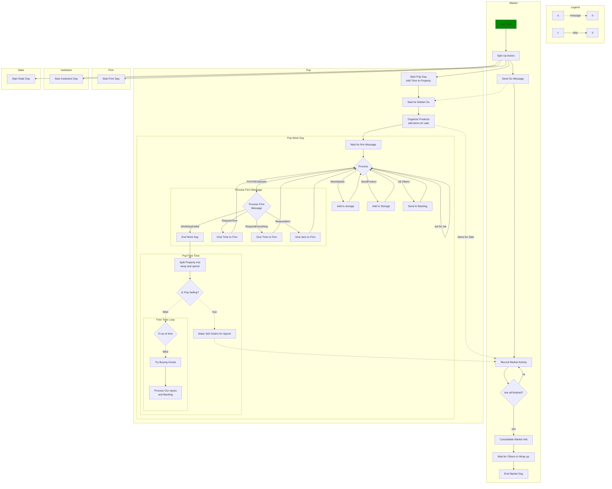

```mermaid
---
Title: Actor messages
---
flowchart TD
    subgraph Legend
        direction LR
        a -.message.-> b
        c --> |step|d
    end
    subgraph Market
        direction LR
        dayStart[Day Start] -->
        spinUp[Spin Up Actors] -->
        goMessage[Send Go Message] -->
        marketRecords[Record Market Activity]
        marketRecords --> checkEnd{Are all finished?}
        checkEnd --> |no|marketRecords
        checkEnd --> |yes|Wrapup[Consolidate Market Info]
        Wrapup --> HoldForFinish[Wait for Others to Wrap up.]
        HoldForFinish --> EndDay[End Market Day]
        style dayStart fill:#080
    end
    subgraph Pop
        direction TB
        spinUp --> 
        popStart[Start Pop Day.\n Add Time to Property.] -->
        popWaitForGo[Wait for Market Go]
        goMessage -.-> popWaitForGo -->
        openSales[Organize Products \n add items for sale]
        openSales -.Items for Sale.-> marketRecords
        openSales --> workMsgWait
        subgraph pwd [Pop Work Day]
            direction LR
            workMsgWait[Wait for firm Message] -->
            popProcessFirmMessage{Process}
            popProcessFirmMessage --> |FirmToEmployee|bossMsg{Process Firm \n Message}
            popProcessFirmMessage --> |WantSplash|splash[Add to storage] --> popProcessFirmMessage
            popProcessFirmMessage --> |SendProduct|recieveProduct[Add to Storage] --> popProcessFirmMessage
            popProcessFirmMessage --> |All Others|popFirmToBacklog[Send to Backlog] --> popProcessFirmMessage
            popProcessFirmMessage --> |not for me|popProcessFirmMessage
            subgraph Process Firm Message
                direction LR
                bossMsg --> |WorkDayEnded|popWorkDayEnded[End Work Day]
                bossMsg --> |RequestTime|requestTime[Give Time to Firm]
                bossMsg --> |RequestEverything|requestEverything[Give Time to Firm]
                bossMsg --> |RequestItem|RequestItem[Give Item to Firm]
            end
            requestEverything --> popProcessFirmMessage
            requestTime --> popProcessFirmMessage
            RequestItem --> popProcessFirmMessage
            popWorkDayEnded --> splitProperty
            subgraph Pop Free Time
                direction LR
                splitProperty[Split Property into\n keep and spend]
                splitProperty --> ifPopSelling{Is Pop Selling?}
                ifPopSelling -.true.-> sellOrderSpend[Make Sell Orders for Spend] -.-> marketRecords
                ifPopSelling -.false.-> ifTimedOut
                subgraph freeTimeLoop [Free Time Loop]
                    direction TB
                    ifTimedOut{If out of time} -.false.-> buyGoods[Try Buying Goods]
                    buyGoods --> processInputs[Process Our inputs\nand Backlog]
                end
            end
        end
    end
    subgraph Firm
        direction LR
        spinUp --> firmStart[Start Firm Day]
    end
    subgraph Institution
        direction LR
        spinUp --> instStart[Start Institution Day]
    end
    subgraph State
        direction LR
        spinUp --> stateStart[Start State Day]
    end
```