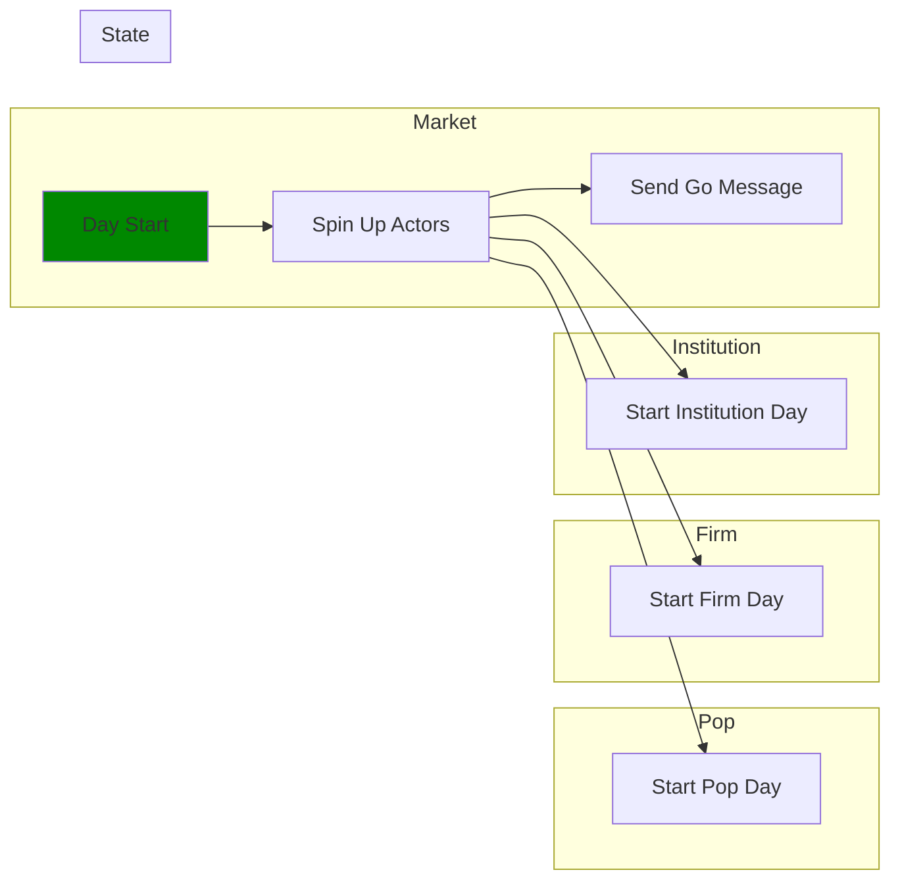

```mermaid
---
Title: Actor messages
---
flowchart LR
    subgraph Market
        direction TB
        dayStart[Day Start]
        dayStart --> spinUp[Spin Up Actors]
        spinUp --> goMessage[Send Go Message]
        style dayStart fill:#080
    end
    subgraph Pop
        direction LR
        spinUp --> popStart[Start Pop Day]
        
    end
    subgraph Firm
        direction LR
        spinUp --> firmStart[Start Firm Day]
    end
    subgraph Institution
        direction LR
        spinUp --> instStart[Start Institution Day]
    end
    subgraph State
    end
```