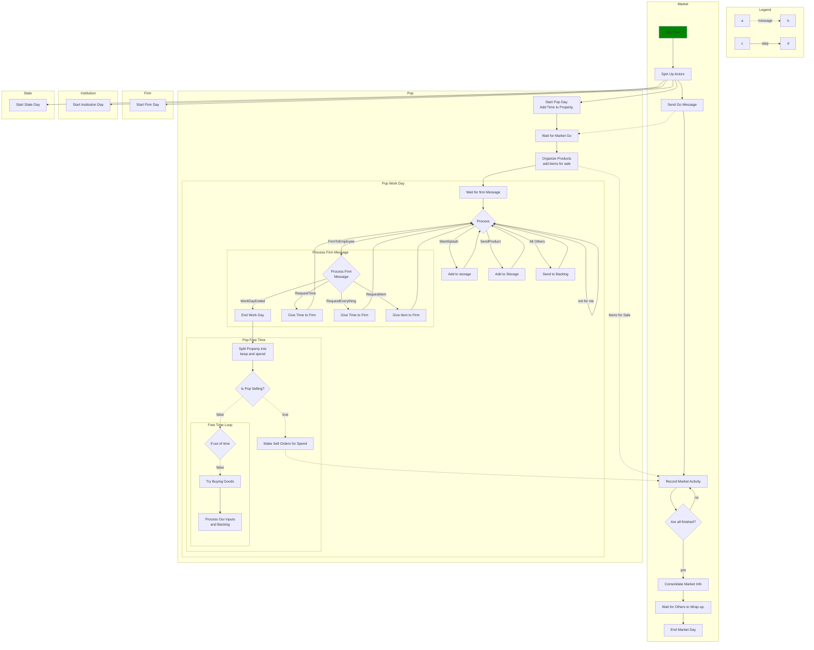
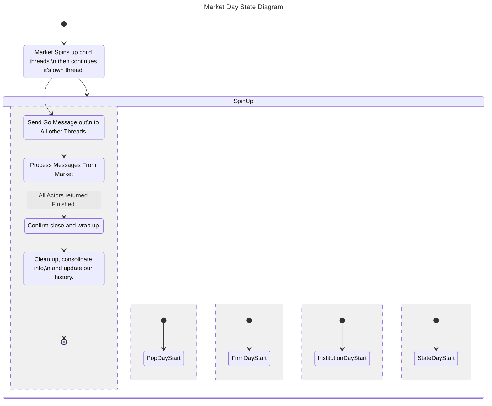

# Market Day State Machine


# Overarching Message Sequence Diagram
```Mermaid
sequenceDiagram
    participant M as Market
    participant O as Other Actor 1
    M ->> O: Spin Up Other Actors
    M ->>+O: ActorMsg::StartDay
    loop Per Message until time runs out
        O ->> M: ActorMessage
        O ->> O: ActorMessage
        M ->> O: ActorMessage
        Note over M,O: Messages Going Back and Forth
    end
    O ->>-M: ActorMsg::Finished
    M ->> O: ActorMsg::AllFinished
```

The diagram above shows how the market day. The market acts as the initiator of the day. It starts by spinning up all the other actors (Pops, Firms, Institutions, and States). 

The other states maybe do some pre-work for the day, Pops add their time for the day. After that, they hold, waiting for ActorMessage::StartDay from the Market.

Once they Recieve that message the move into their next steps. Possibly putting stuff up for sale, dealing with their internal issues. Pops, and their bosses get in touch, trading resources, time, and money so that the boss can do their job going forward. This allows firms, states, and institutions to do their internal work beforehand, typically following through on yesterday's plans for work and processes as well as getting resources it will need to function for the rest of the day.

After the Work Day is complete, enters free time. This is where the bulk of messaging occurs. Pops go out, trying to buy what they need for today and possibly the future. States, Institutions, and Firms focus on buying what they need going forward as well as trying to predict the future, expand their knowledge base, and the like. All actors continue this way until they either run out of things to do (a rarity), or much more likely, run out of time to act. Once they reach either situation, they send ActorMessage::Finished to the market and enter a holding pattern.

This holding pattern focuses on quickly and bruskly completing any messages that come their way. They also record the extra messages recieved for future predictive needs. This holding pattern continues until it recieves ActorMessage::AllFinished from the market. 

Taking a step back to the Market, after the Market Spins up all the Actors and sends ActorMessage::StartDay to the Actors it enters a holding pattern. It's primary task it to recold information, and act as the middle ground for the Actors. A quick overview of what it does in each case.

- Actors offer up Sell Orders for the goods they offer and record them, weighing them based on their price relative to yesterday's average. They also record the price and quantity offered to record the market's supply and prices.
- Actors send Buy Orders for particular goods. The market recieves it, and selects a (potential) seller and sends back that information to the buyer via ActorMessage::FoundProduct. If there are no potential sellers, they instead send back ActorMessage::ProductNotFound.
- ActorMessage::SendProduct and ActorMessage::SendWant are recorded by the market.
- ActorMessage::DumpProduct takes the product within and puts it into the Market Resources, and records that they were dumped.
- ActorMessage::WantSplash is recorded, nothing else.
- ActorMessage::FirmToEmployee and EmployeeToFirm are totally ignored.
- Buy Orders are not moved or redirected by the market, but they are recorded to check the offer being made and modifying market prices based on the success or failure of the offer.

# Pop to Pop Exchange Sequence

Shopping Exchange sequencing occurs between a number of actors. In this case we'll be looking at the most basic 2 actor case and more specifically it's between a