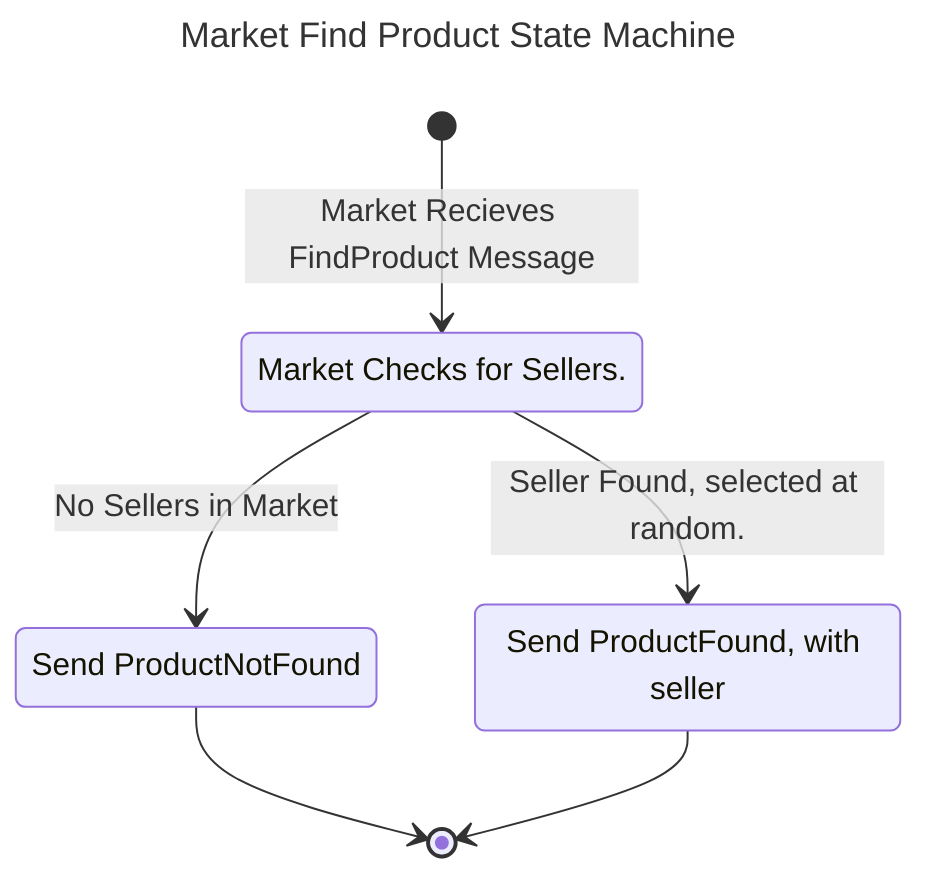
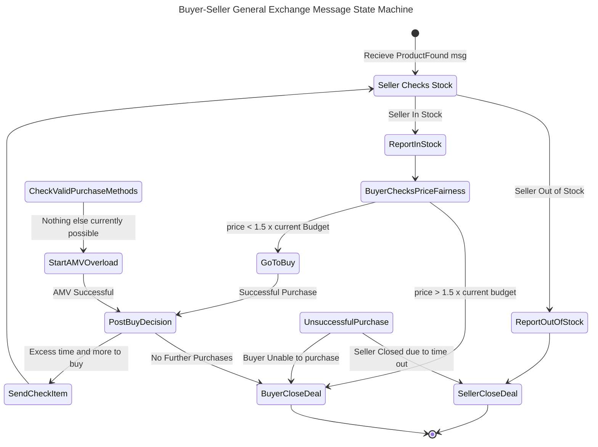
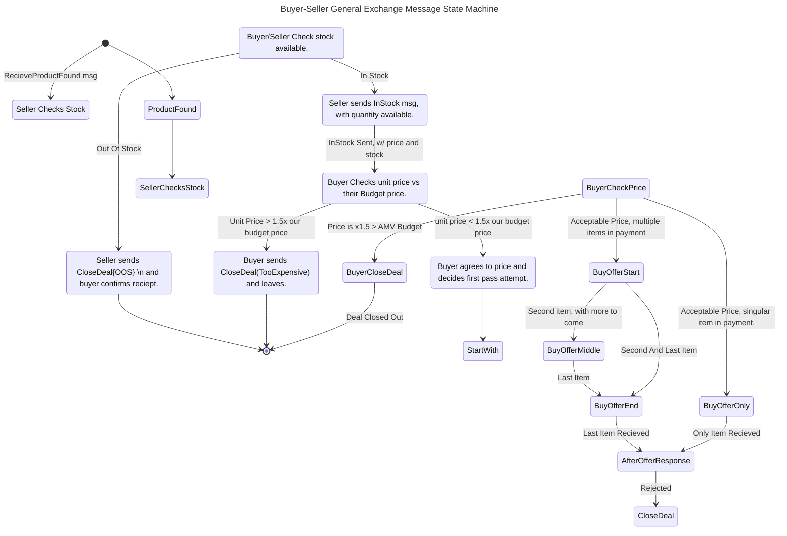

# Buying and Selling
Buying and selling has Two major sections, the Search, and the Deal.

## The Search

Before anything a seller must offer up a Sell Order to the market, if they don't then they cannot normally be reached for a deal. Sell Orders include what product they are offering, their price in AMV, and quantity.

The Buyer must act next by sending out a FindProduct message to the market. The FindProduct message is an incomplete buy order, and includes the product being sought.

The Market, once it recieves a FindProduct Message, begins to look. It should have a list of Actors who sell that product, weighted by the product's price, quantity, and Variety of products. 

If there are no sellers, it returns ProductNotFound, and records that the item was sought out. It adds 1 unit of demand to the item and increases the Products AMV a tiny bit.

If the Market has sellers, it selects one at random and returns ProductFound with the buyer's and seller's id.

## Deals In Action

Should the Market send out a ProductFound Message, the buyer and seller mentioned will eventually read it and enter their 'deal' state. 

During the Deal State, both buyer and seller are locked in until the deal is completed. The only things they can do is add messages to their backlog, and act in the deal.

Once they enter we can assume they are in lockstep, they share the same info for the most part. If they send a message to the other, they will wait, reading into the backlog until the next deal message is recieved.

If the Seller is out of stock the seller Sends a CloseDeal{OutOfStock} message and the buyer doesn't wait, and just drops out of the deal. The Market Recieves this message and reduces the weight of the seller for that item as they are out of stock.

If the seller has stock, then the buyer looks at the price and stock, they check the price per unit vs their price per unit budget. If the item is too expensive (x1.5 their budget value) then they'll reject, Sending a CloseDeal{TooExpensive} then leaving. The seller recieves the response back and records it. The Market also recieves the response, and reduces the Sellers weight. Typically, if the Buyer has enough time, they'll try to buy the same item again, going back to the Search Phase.

If the unit price is less than x1.5 the unit price then they'll buy it, but make their opinion known.

Knowing they'll try to buy what they can, they'll select which method of purchase they'll attempt. They can attempt to pay Cash, if the market has currency, Barter, if the target can barter (only pops can), or if all else fails, they'll attempt an AMV Overload.

### Cash Purchase

Cash Purchase is the preferred method as currencies are almost always accepted, as they are the most Salable good in the Market. The purchase logic is similar to AMV Overload, but limits to just currencies. Cash Purchases use the Cash's full AMV instead of a fraction, but Pops will attepmt to get rid of lower Salable items first, over Higher Salable items.

A Buyer will check if the market has any currencies, then will check it's available currency if it can buy. If it can, it will attempt a Cash Purchase.

The Buyer will organize it's currency to buy. They'll try to buy like their making change, though they'll aim to overshoot by as little as possible to make ends meet.

If they buyer doesn't have enough to buy everything it's asking for, the seller will sell him back the amount covered by the money.

If there is still more to be bought, it will move on the Next valid option, either Barter or AMV Overload. 

If it's done buying this itme, it moves onto checking the next items it wants to see if it can quickly get additional desires.

In this process, the Market listens and looks at the value given in currency, then adjusts the prices of all items to match more correctly to the price given. If the Seller's unit price is above the market AMV price, then the price moves up, if it's below market AMV, the price moves down. The Market also records the amount purchased and how much was traded away also.

### Barter

Barter is among the more complex and also more limited ways to exchange. Not everyone can barter at any time. This is partially to encourage alternative forms of payment, Cash Purchase and AMV Overloading. Only Pops can barter with pops, Firms, Institutions, and States can only exchange through Cash Purchasing, or AMV Overloading

In simplistic economies where most pops are subsistence level pops and produce most of their own needs, this is common, but as an economy becomes more complicated barter becomes harder and the economy becomes more dependent on Cash Purchases and AMV Overload to complete exchanges.

For barter to function, it requires a coincidence of wants, where what the buyer offers is what the seller is looking for. If the coincidence occurs, then they trade. 

What makes this complicated is that the buyer has to be able to guess or know what the seller wants. This can be a problem if the seller isn't a pop, or if they have most of their desires fulfilled. It's also a problem if the seller is an organization who doesn't have much in the way of desires, and them getting them from a barter, may rework their plans later or let them overshoot.

Regardless, barter works buy looking at what is being offered, vs what is being requested, and ensuring that the value gained from the barter is greater. Specifically, Based on the tiers the desire and the requested item, they'll look to give up higher tier items for lower tier items. An item of n tier(s) higher than the target is worth about 0.9n of the lower tier. This never touches AMV.

Typically, the buyer will request info from the seller as to what they are looking for, and will then attempt to offer things for them without sacrificing too much of their own.

### AMV Overload

AMV Overload is the last method and can be thought of as the precursor to Cash Purchasing. It's done when no product has gained currency status in the market, or barter is either unavailable or failed.

AMV Overload allows one to use anything to buy something else, but it comes with a risk. The Buyer offers various products who's AMV is equal to or greater than the targeted item. However, the chance the seller accepts is based on the Salability of the product(s). The lower the Salability, the less likely they are to accept it. Additionally, the bulk and mass of the item offered may reduce it's value further, making it even less likely to be accepted.

To overcome this chance, a Buyer can attempt to overload it. By the time it reaches AMV / Salability, it equals 100%. If an item has a Salability of 0.5, it takes 2x as much AMV for them to be accepted

For Multiple items, the total Salability is given a weighted average based on the items original AMV. Then it's rolled.

So an Item with a salability of 0.5 and AMV of 10 and another with another with Sal of 0.75 and AMV of 5 would combine to create a total AMV of 15 and a resulting salability of 0.583.

The random chance scales the closer the total offered is to PriceAMV/Salability. With that value being 100, and Price == AMV offered being the Salability. So given the previous average salability, and a price point of 15 AMV, the chance at AMV 15 would be the Salability calculated (0.583) this percent of acceptance would max out around
25.728, assuming the same ratio of goods. 

When an offer is made, it the seller accepts or rejects. If it's not at full Salability, then it selects at random. The seller returns Accept or Reject and the current offer completes.

The Market sees both the offer and the Accept/Reject it takes the acception or rejection and modifies the price of both to be more in line. If the offer is rejected the items offered have their price reduced while the item being asked for has it's price increased. If the offer is accepted the prices of the two are pushed closer together and the items offered have their salability improved silghtly. PRice CHanges on both are scaled based on the relate Salabilities of both. The More Salable has it's price changed less and the less Salable more.

